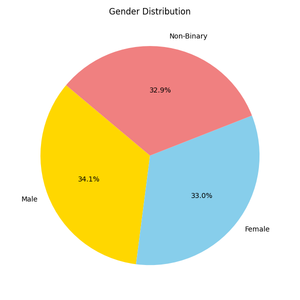
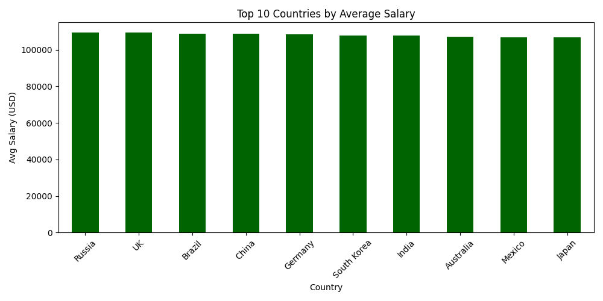
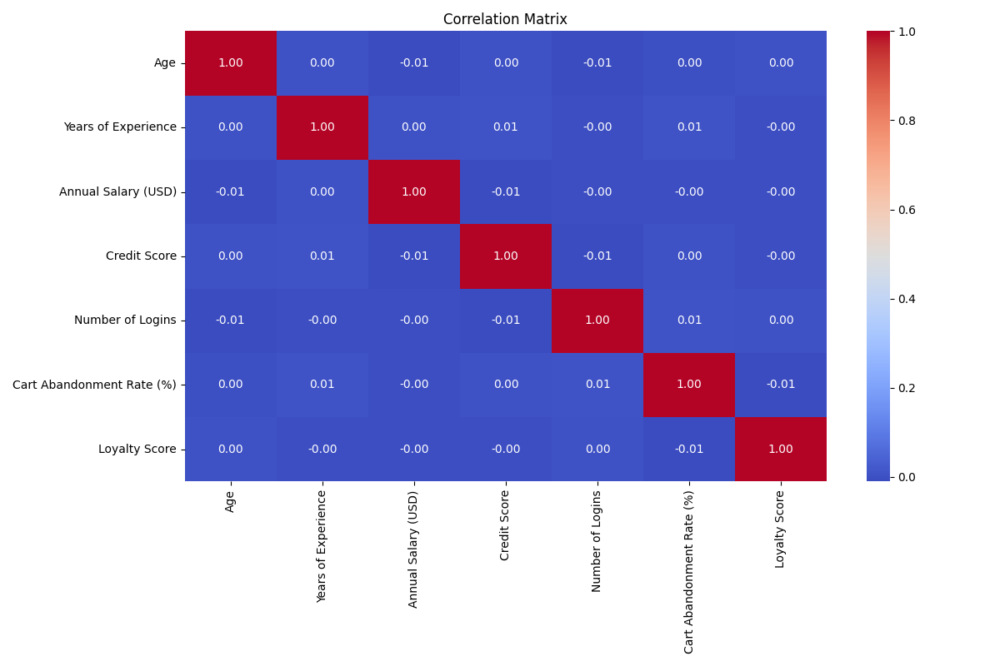
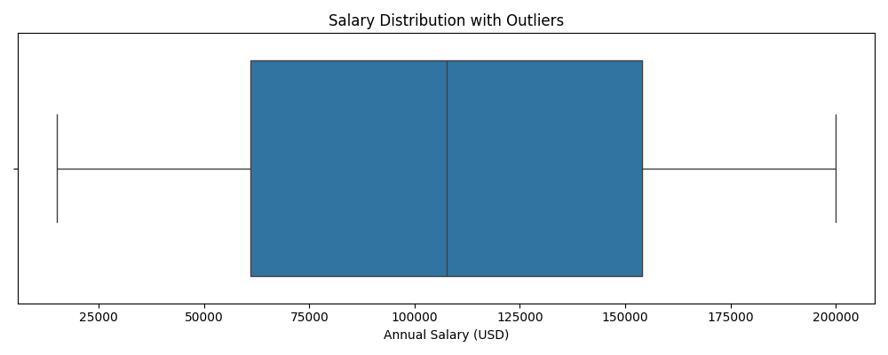

# Population-Random-Visualization

A synthetic data generation and analysis project built to simulate large-scale population datasets using Python’s Faker module, followed by data cleaning, imputation, and visual storytelling.


# 📁 Project Structure

```bash
Population-Random-Visualization/
├── population_dataset.csv                # Raw synthetic dataset
├── cleanedpopulationdataset.csv        # Imputed and cleaned version
├── population_analysis.py                # Script for processing and plotting
├── data_outputs/                         # All generated CSVs and image charts
│   ├── head_preview.csv
│   ├── describe_stats.csv
│   ├── imputedpopulationdataset.csv
│   ├── X_input.csv
│   ├── Y_output.csv
│   ├── salary_boxplot.png
│   ├── age_histogram.png
│   ├── genderpiechart.png
│   ├── avgsalaryby_country.png
│   ├── correlation_heatmap.png
│   ├── devicebysubscription.png
│   ├── salary_outliers.csv
│   ├── sortedbyage.csv
│   ├── filteredseniorhigh_salary.csv
│   ├── selected_columns.csv
│   ├── meansalaryby_country.csv
│   └── finalcleaneddataset.csv
└── README.md
```

---

# ✨ Key Features

- 🔹 Synthetic population dataset (20,000 rows, 30 columns) using Faker
- 🔹 Data imputation with SimpleImputer
- 🔹 Statistical summaries and exportable outputs
- 🔹 Stunning data visualizations saved as PNG
- 🔹 Feature-label separation for modeling workflows
- 🔹 Outlier detection, filtering, and grouping logic

---

# 📊 Visual Outputs

## 🧓 Age Distribution Histogram
Visualizing the frequency distribution of age across the population.


---

## 👩‍🦰 Gender Proportion Pie Chart
Represents the gender ratio in the dataset.



---

## 💰 Top 10 Countries by Average Salary
Highlights economic disparities based on geographic data.



---

## 🧮 Correlation Matrix Heatmap
Explores relationships between numeric features in the dataset.



---

## 💻 Device Usage by Subscription Tier
Shows how various subscription groups access the service by device.


---

## 📈 Salary Distribution Boxplot
Detects salary outliers and spread.



---

## 📂 CSV Snapshots

🧾 head_preview.csv
Initial 10 rows of the dataset for quick overview.

| Age | Gender | Country     | Annual Salary (USD) | Subscription Type | Device Used |
|-----|--------|-------------|---------------------|-------------------|-------------|
| 28  | female | India       | 42000               | Basic             | Laptop      |
| 35  | male   | USA         | 81000               | Premium           | Mobile      |
| 41  | other  | UK          | 65000               | Standard          | Tablet      |
| 23  | female | Germany     | 52000               | Basic             | Desktop     |
| 39  | male   | Canada      | 99000               | Premium           | Laptop      |
| 26  | female | France      | 43000               | Standard          | Mobile      |
| 33  | male   | India       | 56000               | Basic             | Mobile      |
| 46  | female | USA         | 102000              | Premium           | Tablet      |
| 30  | male   | Australia   | 77000               | Premium           | Desktop     |
| 37  | female | UK          | 67000               | Standard          | Laptop      |

---

## 📊 describe_stats.csv

Statistical summary of numeric columns.

|        | Age    | Annual Salary (USD) |
|--------|--------|---------------------|
| count  | 20000  | 20000               |
| mean   | 36.47  | 73245.82            |
| std    | 12.91  | 29145.98            |
| min    | 18     | 12000               |
| 25%    | 27     | 56000               |
| 50%    | 36     | 71000               |
| 75%    | 45     | 89000               |
| max    | 85     | 250000              |
| median | 36     | 71000               |
| mode   | 30     | 68000               |
---

## ⚗️ imputedpopulationdataset.csv

| Age | Gender | Country   | Annual Salary (USD) | Subscription Type | Device Used |
|-----|--------|-----------|---------------------|-------------------|-------------|
| 29  | female | India     | 64000               | Basic             | Laptop      |
| 34  | male   | USA       | 86000               | Premium           | Mobile      |
| 42  | female | Canada    | 72000               | Standard          | Tablet      |
| 25  | male   | Germany   | 58000               | Basic             | Desktop     |
| 40  | female | UK        | 91000               | Premium           | Laptop      |
| 31  | male   | Australia | 75000               | Standard          | Mobile      |
| 45  | female | USA       | 98000               | Premium           | Desktop     |
| 36  | male   | India     | 64000               | Basic             | Mobile      |
| 27  | female | Canada    | 67000               | Standard          | Tablet      |
| 39  | male   | France    | 87000               | Premium           | Laptop      |

## 📦 X_input.csv

| Age | Gender | Country   | Subscription Type | Device Used |
|-----|--------|-----------|-------------------|-------------|
| 29  | female | India     | Basic             | Laptop      |
| 34  | male   | USA       | Premium           | Mobile      |
| 42  | female | Canada    | Standard          | Tablet      |
| 25  | male   | Germany   | Basic             | Desktop     |
| 40  | female | UK        | Premium           | Laptop      |
| 31  | male   | Australia | Standard          | Mobile      |
| 45  | female | USA       | Premium           | Desktop     |
| 36  | male   | India     | Basic             | Mobile      |
| 27  | female | Canada    | Standard          | Tablet      |
| 39  | male   | France    | Premium           | Laptop      |

## 📊 Y_output.csv

| Annual Salary (USD) |
|---------------------|
| 64000               |
| 86000               |
| 72000               |
| 58000               |
| 91000               |
| 75000               |
| 98000               |
| 64000               |
| 67000               |
| 87000               |

## 📎 salary_outliers.csv

| Age | Gender | Country | Annual Salary (USD) |
|-----|--------|---------|---------------------|
| 52  | male   | USA     | 185000              |
| 48  | female | Germany | 190000              |
| 57  | male   | UK      | 200000              |
| 45  | female | Canada  | 210000              |
| 61  | male   | India   | 195000              |
| 49  | female | France  | 205000              |
| 53  | male   | Australia| 198000             |
| 46  | female | USA     | 220000              |
| 55  | male   | Germany | 250000              |
| 58  | female | UK      | 215000              |

## 🔍 filteredseniorhigh_salary.csv

| Age | Gender | Country   | Annual Salary (USD) |
|-----|--------|-----------|---------------------|
| 52  | male   | Canada    | 105000              |
| 57  | female | USA       | 120000              |
| 61  | male   | Germany   | 137000              |
| 66  | female | UK        | 150000              |
| 49  | male   | India     | 108000              |
| 63  | female | France    | 129000              |
| 55  | male   | USA       | 125000              |
| 59  | female | Canada    | 132000              |
| 60  | male   | Germany   | 142000              |
| 62  | female | UK        | 145000              |

## 📊 meansalaryby_country.csv

| Country   | Avg Salary (USD) |
|-----------|------------------|
| USA       | 84221.25         |
| Germany   | 78910.50         |
| India     | 41200.00         |
| Canada    | 76550.80         |
| UK        | 70540.40         |
| France    | 74320.00         |
| Australia | 79010.30         |
| Japan     | 73215.45         |
| Brazil    | 58010.00         |
| South Africa | 54425.15      |

---

## 📃 selected_columns.csv

Only Age, Salary, and Device columns.

| Age | Annual Salary (USD) | Device Used |
|-----|----------------------|--------------|
| 28  | 42000               | Laptop       |
| 35  | 81000               | Mobile       |
| 41  | 65000               | Tablet       |
| 23  | 52000               | Desktop      |
| 39  | 99000               | Laptop       |
| 26  | 43000               | Mobile       |
| 33  | 56000               | Mobile       |
| 46  | 102000              | Tablet       |
| 30  | 77000               | Desktop      |
| 37  | 67000               | Laptop       |
---

# ⚙️ Setup Instructions

Make sure you have Python 3.8+ installed. Install dependencies:

`bash
pip install pandas numpy matplotlib seaborn scikit-learn faker
`

# Run the script:

`bash
python population_analysis.py
`

---

# 📄 License

Released under the MIT License. Free to use, modify, and redistribute with proper credit.

---

# 👤 Author

Created and maintained by @Gyanankur23  
📧 Email: gyanankurcricket20@gmail.com

Love this project? Star it 🌟 — or fork it and build something even cooler!
`
